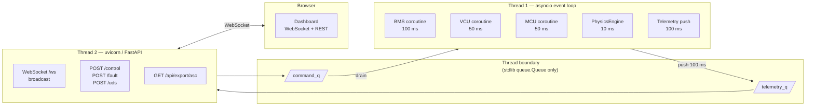
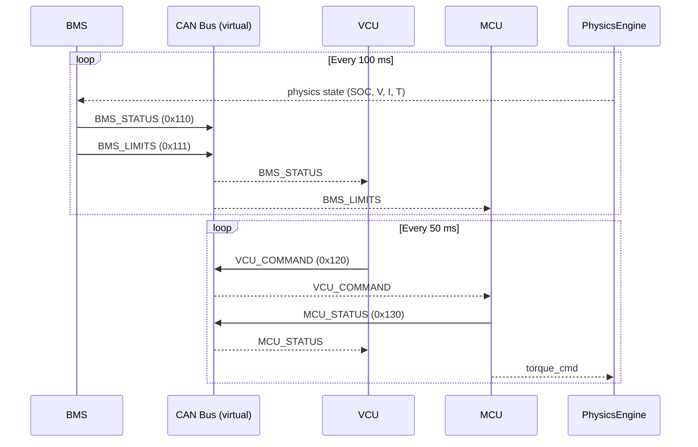
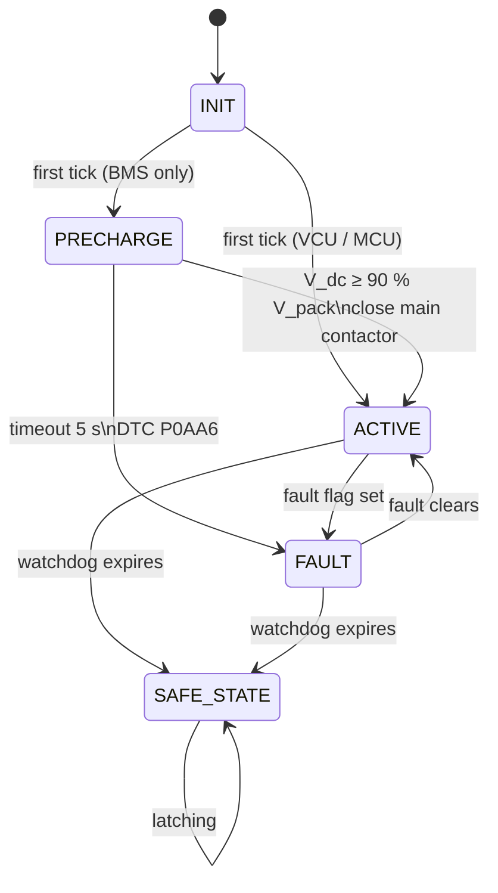
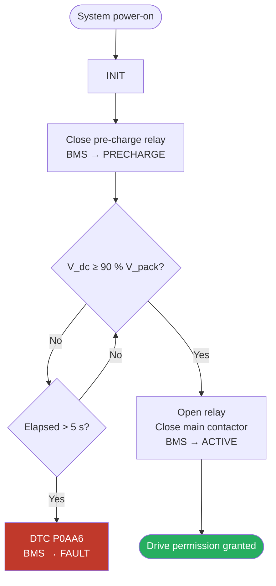
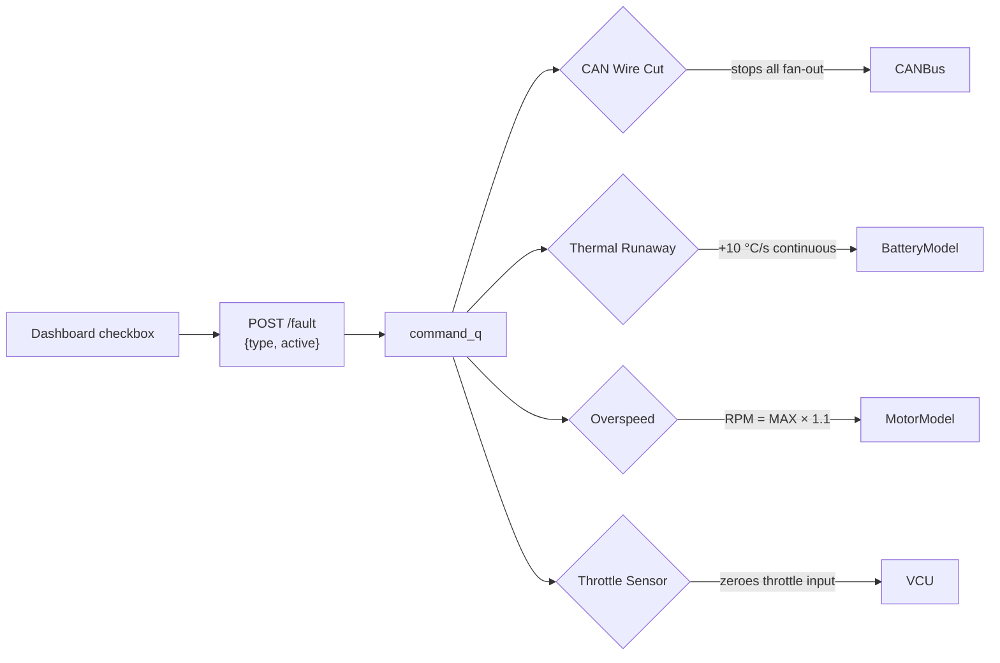

# EV CAN Bus Simulation

**A real-time, physics-accurate electric vehicle powertrain simulator with a live web dashboard, ISO 14229 UDS diagnostics, and CANalyzer-compatible log export.**

[](https://python.org)
[](https://fastapi.tiangolo.com)
[](tests/)
[](can_bus.dbc)
[](src/ecu/base_ecu.py)
[](LICENSE)

---

Three software ECUs (BMS, VCU, MCU) run as independent asyncio coroutines, each with a finite state machine, watchdog timer, and ISO 14229 UDS handler. They communicate exclusively over a virtual CAN 2.0A bus backed by a real DBC file. A 1RC Thevenin battery model, a full vehicle dynamics engine, and a physics-accurate pre-charge sequence run at 10 ms steps. Everything streams live to a glassmorphic WebSocket dashboard and exports to CANalyzer `.asc` format in one click.

---

## Table of Contents

- [Feature Highlights](#feature-highlights)
- [Quick Start](#quick-start)
- [Architecture](#architecture)
  - [Two-Thread Model](#two-thread-model)
  - [CAN Bus Actor Model](#can-bus-actor-model)
  - [ECU State Machine](#ecu-state-machine)
  - [Pre-Charge FSM](#pre-charge-fsm)
- [Project Structure](#project-structure)
- [Configuration](#configuration)
- [Physics Models](#physics-models)
  - [Battery — 1RC Thevenin ECM](#battery--1rc-thevenin-ecm)
  - [Vehicle Dynamics](#vehicle-dynamics)
  - [Motor Model](#motor-model)
- [ECU Reference](#ecu-reference)
- [Fault Injection](#fault-injection)
- [UDS Diagnostics](#uds-diagnostics)
- [API Reference](#api-reference)
- [Testing](#testing)
- [CAN Log Export](#can-log-export)
- [Dashboard](#dashboard)

---

## Feature Highlights

| Capability | Detail |
|---|---|
| **Real DBC file** | `cantools` encodes/decodes all 4 messages, 14 signals with correct Motorola / Intel byte ordering |
| **1RC Thevenin ECM** | OCV–SOC interpolation, temperature-dependent resistances, exact exponential RC integration (unconditionally stable) |
| **Pre-charge FSM** | RC capacitor physics: τ = 0.5 s, 90 % threshold ≈ 1.15 s, DTC P0AA6 on 5 s timeout |
| **ISO 14229 UDS** | Services 0x22 ReadDataByIdentifier, 0x19 ReadDTCInformation, 0x14 ClearDTCInformation on all 3 ECUs |
| **ISO 26262 ASIL-B** | Simultaneous throttle + brake plausibility check → torque cut to 0 Nm instantly |
| **Fault injection** | CAN wire cut, CRC corruption, thermal runaway, overspeed — all controllable from the dashboard |
| **CANalyzer export** | Full session log (50 000 frames) in Vector `.asc` format, compatible with CANalyzer, PCAN-Explorer, `cantools` CLI |
| **Live dashboard** | WebSocket telemetry at 100 ms, animated SVG speedometer, 60 s rolling Chart.js traces, UDS quick-test buttons |
| **6 automated tests** | pytest-asyncio covering DBC roundtrip, energy balance, FSM transitions, watchdogs, plausibility, regen clamping |

---

## Quick Start

**Requirements:** Python 3.11 or later.

```bash
# 1 — clone
git clone https://github.com/<username>/arys-eee-can-sim.git
cd arys-eee-can-sim

# 2 — virtual environment
python -m venv .venv
source .venv/bin/activate        # Windows: .venv\Scripts\activate

# 3 — install
pip install -r requirements.txt

# 4 — run tests (optional but recommended)
pytest

# 5 — start the simulation
python run.py
```

Open **http://localhost:8000** in your browser. The BMS badge will show **PRECHARGE** for ~1.2 s while the DC link capacitor charges, then switch to **ACTIVE** — drive permission is granted and the simulation is live.

Press `Ctrl+C` to stop.

---

## Architecture

### Two-Thread Model

The runtime splits across exactly two OS threads. The only data that crosses the boundary are two `stdlib queue.Queue` objects — the one thread-safe primitive in Python that requires no asyncio awareness.



> **Invariant:** `asyncio.Queue`, `asyncio.Event`, and `asyncio.Lock` never cross the thread boundary. Any future feature that needs to pass data between threads must use `queue.Queue`.

---

### CAN Bus Actor Model

Each ECU owns one `asyncio.Queue` inbox. `CANBus.publish()` fan-outs encoded frames to all subscribed queues. ECUs never read each other's memory — they only react to frames, exactly like real CAN nodes on a shared bus.



---

### ECU State Machine

All three ECUs share this FSM, implemented in `BaseECU`. The `SAFE_STATE` is **latching** — only a full restart clears it.



---

### Pre-Charge FSM

Before the main contactor closes, the BMS ramps the DC link capacitor through a series resistor to prevent inrush current damage. This runs inside the BMS coroutine; the capacitor physics run in the PhysicsEngine at 10 ms resolution.



**RC physics:**

```
τ = R_precharge × C_dclink = 100 Ω × 5 mF = 0.5 s
V_dc(t) = V_pack × (1 − e^(−t/τ))
90 % threshold reached at t ≈ −τ ln(0.1) ≈ 1.15 s
```

---

## Project Structure

```
arys-eee-can-sim/
│
├── run.py                   # Entry point — wires ECUs, physics, both threads
├── can_bus.dbc              # CAN database (4 messages, 14 signals)
├── requirements.txt
├── pytest.ini
├── .gitignore
│
├── config/
│   ├── battery.yaml         # Pack geometry, ECM, thermal, protection, pre-charge
│   ├── vehicle.yaml         # Chassis, motor, VCU parameters
│   └── can_config.yaml      # Baudrate, message IDs, watchdog timeouts
│
├── src/
│   ├── config_loader.py     # Pydantic v2 models — validates config at startup
│   ├── can_bus.py           # CANBus: publish, subscribe, bus-load, .asc export
│   ├── physics.py           # BatteryModel1RC, MotorModel, VehicleModel, PhysicsEngine
│   └── ecu/
│       ├── base_ecu.py      # BaseECU, ECUState, WatchdogTimer, UDS handler, DTC encoder
│       ├── bms.py           # BMS: pre-charge FSM, protection, derating
│       ├── vcu.py           # VCU: ASIL-B plausibility, torque slew limiter
│       └── mcu.py           # MCU: overspeed, thermal derating, current clamping
│   └── web/
│       ├── server.py        # FastAPI app, WebSocket broadcast, /api/export/asc
│       └── static/
│           ├── index.html   # Dashboard layout (11 panel cards)
│           ├── app.js       # WebSocket client, Chart.js, control handlers
│           └── style.css    # Dark glassmorphism theme
│
├── tests/
│   └── test_simulation.py   # 6 pytest-asyncio tests
│
└── docs/
    ├── REPORT.md            # Full project report (Markdown)
    └── REPORT.tex           # Full project report (LaTeX / Overleaf)
```

---

## Configuration

All physical parameters live in `config/` YAML files. **No code changes are needed to tune the simulation** — Pydantic v2 validates every field at startup and raises a typed error before the simulation starts if any value is out of range.

### `config/battery.yaml` — key fields

| Parameter | Default | Description |
|---|---|---|
| `cells_series` | 10 | Cells in series |
| `cells_parallel` | 10 | Cells in parallel |
| `cell_capacity_ah` | 5.0 | Per-cell capacity (Ah) |
| `r0_ohm` | 0.025 | Series resistance (Ω) |
| `r1_ohm` | 0.005 | RC branch resistance (Ω) |
| `c1_farad` | 3000 | RC branch capacitance (F) |
| `max_discharge_current_a` | 200 | Discharge current limit (A) |
| `max_charge_current_a` | 30 | Charge current limit (A) |
| `max_cell_temperature_c` | 55 | OTP threshold (°C) |
| `precharge_resistor_ohm` | 100 | Pre-charge series resistor (Ω) |
| `dc_link_capacitance_f` | 0.005 | DC link capacitance (F) |
| `precharge_timeout_s` | 5.0 | Pre-charge fault timeout (s) |

### `config/vehicle.yaml` — key fields

| Parameter | Default | Description |
|---|---|---|
| `mass_kg` | 200 | Vehicle mass (kg) |
| `wheel_radius_m` | 0.30 | Wheel radius (m) |
| `gear_ratio` | 5.0 | Motor-to-wheel gear ratio |
| `drag_coefficient` | 0.40 | Aerodynamic drag coefficient |
| `peak_torque_nm` | 250 | Motor peak torque (Nm) |
| `peak_power_w` | 30 000 | Motor peak power (W) |
| `efficiency` | 0.92 | Motor–inverter efficiency |
| `max_rpm` | 10 000 | Maximum motor speed (rpm) |
| `torque_slew_rate` | 300 | Torque ramp rate limit (Nm/s) |

---

## Physics Models

### Battery — 1RC Thevenin ECM

```
         R0(T)          R1(T)
  ┌──────/\/\/──────┬───/\/\/───┐
  │                 │           │
V_OCV(SOC)         C1        V_terminal
  │                 │           │
  └─────────────────┴───────────┘
```

**Temperature-dependent resistance:**
```
R(T) = R_ref × exp(−α × (T − T_amb))
```

**RC branch — exact exponential integration (unconditionally stable):**
```
τ = R1 × C1
V_RC(t+dt) = V_RC(t) × exp(−dt/τ) + I × R1 × (1 − exp(−dt/τ))
V_terminal = V_OCV(SOC) − I × R0 − V_RC
```

Using exact integration instead of Forward Euler prevents numerical explosion when `τ → 0` at elevated temperatures — a common failure mode in battery simulators.

**State of charge (Coulomb counting):**
```
ΔSOC = −I × dt / (3600 × Q_pack)
```

**Thermal model:**
```
dT/dt = (I² × R0 + V_RC² / R1 − h × (T − T_amb)) / C_thermal

h = 25 W/K   (active cooling, T > 35 °C)
h =  5 W/K   (passive,        T ≤ 35 °C)
```

---

### Vehicle Dynamics

```
F_drive = T_actual × G_ratio / r_wheel
F_drag  = ½ × ρ × C_d × A × v²
F_roll  = m × g × C_rr          (v > 0.01 m/s)
F_brake = β_brake / 100 × m × g × 0.3

a = (F_drive − F_drag − F_roll − F_brake) / m
```

| Symbol | Value |
|---|---|
| m (mass) | 200 kg |
| r (wheel radius) | 0.30 m |
| G (gear ratio) | 5.0 |
| C_d (drag coefficient) | 0.40 |
| A (frontal area) | 0.60 m² |
| C_rr (rolling resistance) | 0.015 |
| ρ (air density) | 1.225 kg/m³ |

---

### Motor Model

```
ω = π × |RPM| / 30                          (rad/s)
T_max = min(T_peak, P_peak / ω) × derate(T_motor)

derate = 1.0                              T_motor < 120 °C
       = 1 − (T_motor − 120) / 80        120 ≤ T_motor < 200 °C
       = 0.0                              T_motor ≥ 200 °C
```

**Current clamping (discharge and regen):**
The MCU scales `T_cmd` such that the resulting battery current never exceeds `BMS_MaxDischargeCurrent` or `BMS_MaxChargeCurrent`. A second hard-clamp in the PhysicsEngine acts as a hardware fuse backstop.

---

## ECU Reference

### BMS — Battery Management System (`src/ecu/bms.py`)

**Cycle:** 100 ms | **CAN TX:** `BMS_STATUS (0x110)`, `BMS_LIMITS (0x111)`

| Protection | Threshold | DTC | Action |
|---|---|---|---|
| Overvoltage (OVP) | Cell > 4.25 V | — | FaultFlags bit 0, revoke DrivePermission |
| Overtemperature (OTP) | T > 55 °C | P0A1F | FaultFlags bit 1 |
| Undervoltage (UVP) | Cell < 2.80 V | P0A7F | FaultFlags bit 2 |
| Overcurrent (OCP) | I > 200 A | P0A0D | FaultFlags bit 3 |
| Pre-charge timeout | > 5 s | P0AA6 | BMS → FAULT |

---

### VCU — Vehicle Control Unit (`src/ecu/vcu.py`)

**Cycle:** 50 ms | **CAN TX:** `VCU_COMMAND (0x120)` | **CAN RX:** `BMS_STATUS`, `MCU_STATUS`

| Feature | Detail |
|---|---|
| **ASIL-B plausibility** | Throttle > 5 % AND brake > 5 % → `TorqueRequest = 0 Nm` immediately |
| **Torque slew limiter** | `ΔT_cmd ≤ 300 Nm/s` per cycle — protects mechanical drivetrain |
| **BMS watchdog** | 250 ms timeout → SAFE_STATE + DTC U0100 |
| **MCU watchdog** | 150 ms timeout → SAFE_STATE + DTC U0101 |

---

### MCU — Motor Control Unit (`src/ecu/mcu.py`)

**Cycle:** 50 ms | **CAN TX:** `MCU_STATUS (0x130)` | **CAN RX:** `VCU_COMMAND`, `BMS_LIMITS`

| Feature | Detail |
|---|---|
| **Overspeed** | RPM > 10 500 → latching SAFE_STATE + DTC P0C70 |
| **Thermal derating** | Linear reduction 120 °C → 200 °C |
| **Discharge clamp** | Scales torque so I_battery ≤ MaxDischargeCurrent |
| **Regen clamp** | Scales negative torque so I_regen ≤ MaxChargeCurrent |
| **VCU watchdog** | 150 ms timeout → SAFE_STATE |

---

## Fault Injection

Faults are injected via the dashboard checkboxes or `POST /fault`:



| Fault | Mechanism | System Response |
|---|---|---|
| **CAN Wire Cut** | `CANBus` stops fanning out frames | Bus load → 0 %; all ECU watchdogs expire → SAFE_STATE + U0100 / U0101 |
| **Thermal Runaway** | Continuous +0.1 °C per 10 ms step (+10 °C/s) | OTP at 55 °C → P0A1F → DrivePermission revoked → VCU cuts torque |
| **Overspeed** | Physics RPM forced to `MAX_RPM × 1.1` | MCU detects → DTC P0C70 → latching SAFE_STATE |
| **Throttle Sensor Fail** | VCU ignores slider, substitutes 0 % | Torque drops to 0 Nm; BMS / MCU unaffected |

---

## UDS Diagnostics

All three ECUs implement a subset of ISO 14229-1 Unified Diagnostic Services.

**DTC encoding (ISO 14229-1 / SAE J2012DA):**
```
Byte 0–1:  16-bit DTC word
           bits 15:14 = category  (P=00, C=01, B=10, U=11)
           bits 13:12 = first hex digit
           bits  11:0 = remaining 3 hex digits
Byte 2:    status mask 0x08 (confirmedDTC)

Example: U0100 → 0xC1 0x00 0x08
```

**Supported services:**

| SID | Subfunction | Request (hex) | Response |
|---|---|---|---|
| 0x22 ReadDataByIdentifier | DID 0xF190 (VIN) | `22 F1 90` | `62 F1 90` + 15-byte VIN |
| 0x22 ReadDataByIdentifier | DID 0xF18C (ECU S/N) | `22 F1 8C` | `62 F1 8C` + 8-byte name |
| 0x19 ReadDTCInformation | 0x02 by status mask | `19 02 0F` | `59 02 FF` + DTC records |
| 0x14 ClearDiagnosticInfo | 0xFFFFFF all groups | `14 FF FF FF` | `54` positive |
| 0x7F NegativeResponse | any unsupported | — | `7F <SID> <NRC>` |

**Quick test via curl:**
```bash
# Read VIN from BMS
curl -s -X POST http://localhost:8000/uds \
  -H "Content-Type: application/json" \
  -d '{"target": "bms", "payload": [0x22, 0xF1, 0x90]}'

# Read active DTCs from VCU
curl -s -X POST http://localhost:8000/uds \
  -H "Content-Type: application/json" \
  -d '{"target": "vcu", "payload": [0x19, 0x02, 0x0F]}'

# Clear all DTCs on MCU
curl -s -X POST http://localhost:8000/uds \
  -H "Content-Type: application/json" \
  -d '{"target": "mcu", "payload": [0x14, 0xFF, 0xFF, 0xFF]}'
```

---

## API Reference

### WebSocket — `ws://localhost:8000/ws`

The server pushes a JSON snapshot every 100 ms:

```jsonc
{
  "bms": {
    "soc": 79.2,                // State of Charge (%)
    "voltage": 36.8,            // Pack terminal voltage (V)
    "current": 42.5,            // Pack current (A, + = discharge)
    "temperature": 28.3,        // Pack temperature (°C)
    "fault_flags": 0,           // Bitmask: OVP|OTP|UVP|OCP
    "drive_permission": true,
    "max_discharge_current": 200.0,
    "max_charge_current": 30.0,
    "v_dc_link": 36.8,          // DC link voltage (V)
    "precharge_relay": false,
    "main_contactor": true,
    "state": "ACTIVE",
    "dtcs": []
  },
  "vcu": {
    "throttle_pct": 45.0,
    "brake_pct": 0.0,
    "torque_request_nm": 112.5,
    "state": "ACTIVE",
    "dtcs": []
  },
  "mcu": {
    "actual_torque_nm": 109.8,
    "motor_rpm": 4210,
    "motor_temp_c": 34.1,
    "inverter_temp_c": 31.6,
    "state": "ACTIVE",
    "dtcs": []
  },
  "vehicle": {
    "speed_kmh": 68.4,
    "power_kw": 1.56
  },
  "can_bus": {
    "bus_load_pct": 6.8,
    "recent_frames": [...]
  }
}
```

### REST Endpoints

| Method | Path | Body | Description |
|---|---|---|---|
| `POST` | `/control` | `{"throttle": 0–100, "brake": 0–100}` | Set rider inputs |
| `POST` | `/fault` | `{"type": "wire_cut\|thermal_runaway\|overspeed\|throttle_sensor", "active": bool}` | Toggle fault injection |
| `POST` | `/uds` | `{"target": "bms\|vcu\|mcu", "payload": [byte, ...]}` | Send UDS request |
| `GET` | `/api/export/asc` | — | Download full session CAN log as `.asc` |
| `GET` | `/` | — | Serve dashboard HTML |
| `GET` | `/static/*` | — | Serve dashboard assets |

---

## Testing

```bash
pytest                  # run all tests
pytest -v               # verbose output
pytest -k "watchdog"    # run a specific test by name
```

| Test | What it covers |
|---|---|
| `test_dbc_roundtrip` | All 4 messages encode → decode within DBC tolerance; asserts Motorola byte order on MCU_STATUS bytes 2–3 |
| `test_soc_energy_balance` | 100 A × 360 s discharge → ΔSOC = 20.0 % ± 0.5 % (Coulomb counting accuracy) |
| `test_fsm_transitions` | BMS: INIT → PRECHARGE (tick 1); PRECHARGE → ACTIVE at V_dc = 95 % (tick 2); VCU ACTIVE → FAULT; MCU SAFE_STATE → torque = 0 |
| `test_watchdog_expiry` | VCU watchdog at 100 ms; silence for 150 ms → SAFE_STATE + DTC U0100 |
| `test_plausibility` | Throttle 80 % + brake 20 % → TorqueRequest = 0 Nm; throttle only → positive torque |
| `test_regen_clamp` | 200 Nm regen demand + MaxChargeCurrent = 10 A → actual regen current ≤ 10.1 A |

**Expected output:**
```
tests/test_simulation.py::test_dbc_roundtrip       PASSED
tests/test_simulation.py::test_soc_energy_balance  PASSED
tests/test_simulation.py::test_fsm_transitions     PASSED
tests/test_simulation.py::test_watchdog_expiry     PASSED
tests/test_simulation.py::test_plausibility        PASSED
tests/test_simulation.py::test_regen_clamp         PASSED

6 passed in 0.73s
```

---

## CAN Log Export

While the simulation is running, every CAN frame is appended to a 50 000-frame circular buffer (≈ 10 min at full bus rate). Click **Export .asc** in the CAN Sniffer panel, or:

```bash
curl http://localhost:8000/api/export/asc -o session.asc
```

The resulting file is a valid Vector CANalyzer trace:

```
date Sun Jun 07 03:06:05.000 2026
base hex  timestamps absolute
no internal events logged
   0.000000 1  110             Rx   d 8 20 03 74 0E EC 13 41 10
   0.000312 1  111             Rx   d 8 C8 00 1E 00 00 00 00 00
   0.000418 1  120             Rx   d 8 00 00 00 00 00 00 00 00
   0.000521 1  130             Rx   d 8 00 00 00 00 00 00 00 00
   ...
End TriggerBlock
```

**Toolchain compatibility:**

```bash
# cantools CLI
cantools decode can_bus.dbc session.asc

# Vector CANalyzer — open directly
# PEAK PCAN-Explorer — open directly
```

---

## Dashboard

The dashboard is served at `http://localhost:8000` and communicates exclusively over WebSocket.

| Panel | Content |
|---|---|
| **Vehicle Speed** | Animated SVG arc speedometer (0–150 km/h), VCU FSM badge |
| **Power Output** | Pack current, terminal voltage, kW readout, DC link voltage, contactor state |
| **State of Charge** | Colour-coded progress bar, max discharge / charge current limits |
| **Battery Temp** | Temperature badge (NOMINAL / WARNING / CRITICAL), motor and inverter temps |
| **CAN Sniffer** | Scrolling frame list (timestamp, ID, name, hex, parsed), live bus load %, Export .asc button |
| **DTC Panel** | Active DTC list per ECU, Clear DTCs button, UDS quick-test buttons |
| **Telemetry Chart** | 60 s rolling Chart.js traces: speed, torque request, actual torque, motor temp |
| **Throttle / Brake** | HTML range sliders, values sent on every input event |
| **Fault Injection** | Toggle checkboxes: CAN Wire Cut, Thermal Runaway, Overspeed, Throttle Sensor Fail |
| **MCU Status** | Torque request vs actual, motor RPM, throttle % |

---

## End-to-End Runbook

| # | Scenario | How to trigger | Expected result |
|---|---|---|---|
| 1 | **Cold start** | `python run.py` | BMS: PRECHARGE → ACTIVE in ~1.2 s; DC link voltage ramps 0 → 37 V |
| 2 | **Full throttle** | Throttle slider → 100 % | Current clamps at 200 A; speed climbs to ~117 km/h |
| 3 | **Coast** | Throttle → 0, brake → 0 | Current drops to ~0.5 A quiescent; speed decays by drag |
| 4 | **Regen braking** | Brake → 60 % | Negative current (charging); SOC rises slightly |
| 5 | **Plausibility fault** | Throttle 80 % + Brake 20 % | Torque request instantly → 0 Nm; ASIL-B label visible |
| 6 | **Thermal runaway** | Fault panel → Thermal Runaway ON | Temp rises 10 °C/s; OTP at 55 °C; P0A1F; drive inhibited |
| 7 | **CAN wire cut** | Fault panel → CAN Wire Cut ON | Bus load → 0 %; watchdogs expire; all ECUs → SAFE_STATE |
| 8 | **Clear and recover** | UDS panel → Clear DTC (MCU) then Wire Cut OFF | DTCs clear; ECUs recover to ACTIVE |

---

## Acknowledgements

- [cantools](https://github.com/eerimoq/cantools) — DBC parsing and CAN frame encoding
- [FastAPI](https://fastapi.tiangolo.com) — async web framework
- [Chart.js](https://www.chartjs.org) — real-time telemetry charts
- ISO 14229-1:2020 — Unified Diagnostic Services specification
- ISO 26262:2018 — Road Vehicles Functional Safety
- Plett, G. L. — *Battery Management Systems, Vol. I: Battery Modeling* (Thevenin ECM reference)

---

## License

MIT — see [LICENSE](LICENSE) for details.
